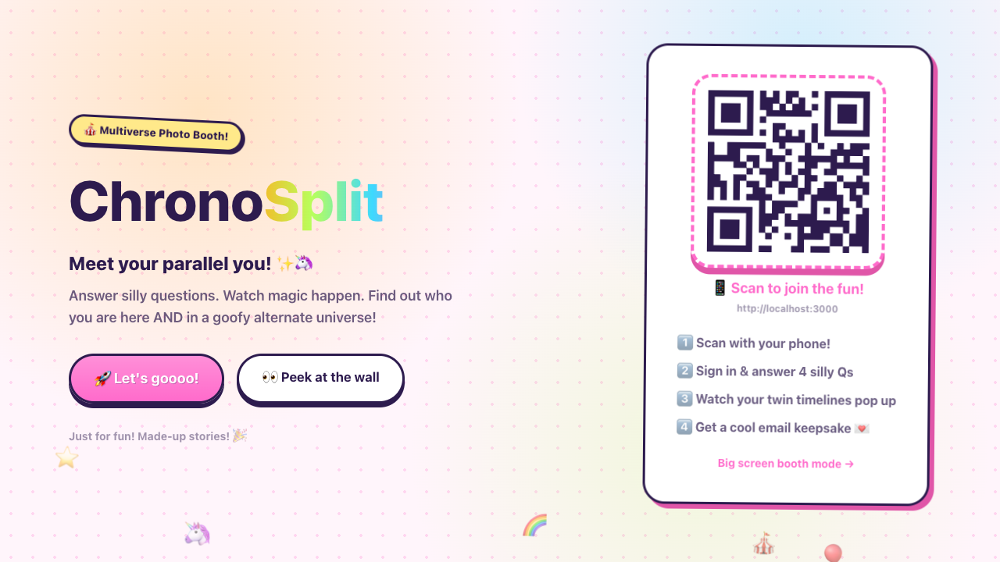
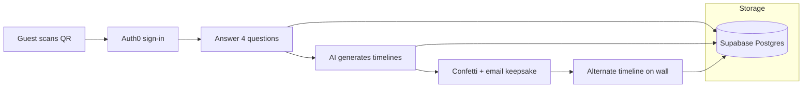
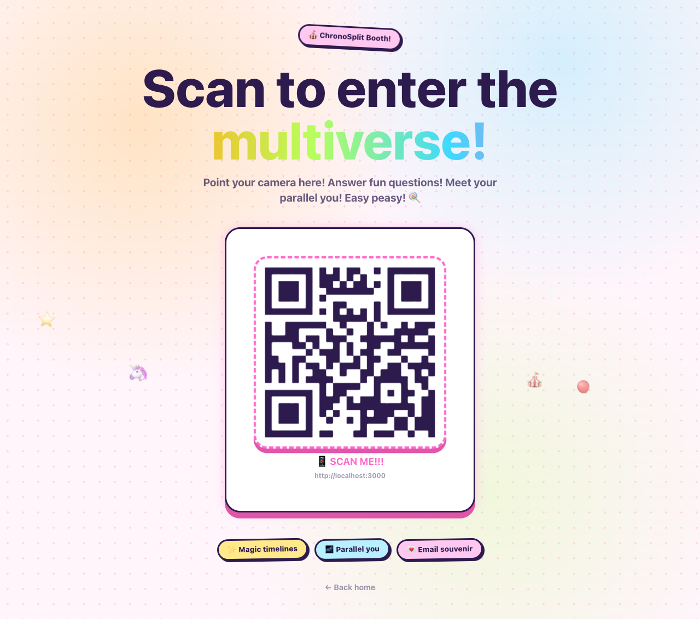
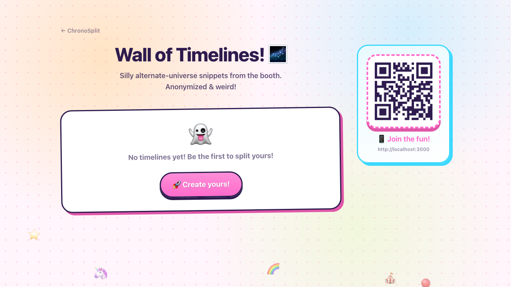
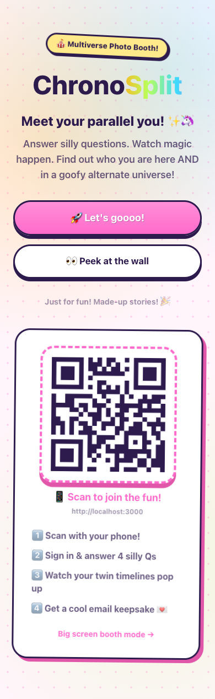
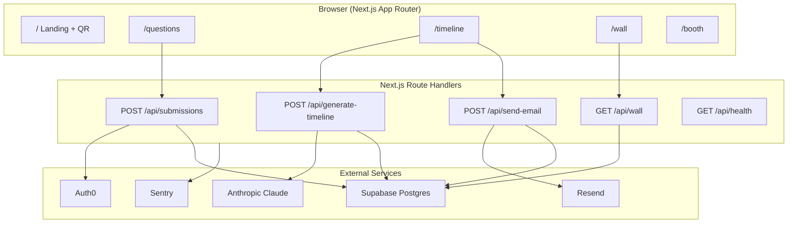

<p align="center">
  <strong>ChronoSplit</strong><br />
  <em>A playful multiverse photo booth for events, hackathons, and demos.</em>
</p>

<p align="center">
  <a href="https://chronosplit.vercel.app"></a>
  <a href="https://github.com/7dracoder/chronosplit"></a>
  <a href="https://github.com/7dracoder/chronosplit"></a>
  <a href="https://github.com/7dracoder/chronosplit"></a>
  <a href="https://github.com/7dracoder/chronosplit"></a>
</p>

---

## Overview

**ChronoSplit** is an interactive, AI-powered photo booth experience. Guests scan a QR code, sign in, answer four playful questions about themselves, and watch the app generate two parallel life stories in real time:

- **This Timeline You** — a grounded, flattering portrait of who they are today
- **Alternate Timeline You** — a fun, exaggerated multiverse version of their life

When generation completes, the guest receives a keepsake email and their alternate timeline can appear on a public **Wall of Timelines** (anonymized snippets only).

Built for live events: run `/booth` on a big screen with a QR code, let attendees join from their phones, and collect delightful main-character moments at scale.

<p align="center">
  
  <br />
  <sub>Landing page with QR join flow and sign-in CTA</sub>
</p>

---

## Table of Contents

- [Features](#features)
- [How It Works](#how-it-works)
- [Screenshots](#screenshots)
- [Architecture](#architecture)
- [Tech Stack](#tech-stack)
- [Quick Start](#quick-start)
- [Environment Variables](#environment-variables)
- [Auth0 Setup](#auth0-setup)
- [Supabase Setup](#supabase-setup)
- [API Reference](#api-reference)
- [Project Structure](#project-structure)
- [Event Booth Mode](#event-booth-mode)
- [Graceful Fallbacks](#graceful-fallbacks)
- [Scripts & Tooling](#scripts--tooling)
- [Deploy to Vercel](#deploy-to-vercel)
- [License](#license)

---

## Features

| Feature | Description |
|---------|-------------|
| **QR-first join flow** | Guests scan a QR code on `/` or `/booth` to start on their phone |
| **Auth0 login** | Secure sign-in via GitHub, Google, or other Auth0 connections |
| **Playful questionnaire** | Four prompts: vibe, dream city, secret talent, optional wild goal |
| **Live AI timelines** | Claude streams structured JSON via Vercel AI SDK (`streamObject`) |
| **Dual timeline reveal** | Side-by-side cards with typewriter effect and confetti celebration |
| **Email keepsake** | Branded React Email template sent through Resend |
| **Public wall** | Latest alternate-universe snippets, anonymized, no PII exposed |
| **Kiosk booth mode** | Full-screen QR display at `/booth` for projectors and monitors |
| **Resilient dev experience** | In-memory storage, template stories, and skipped email when keys are missing |
| **Observability** | Sentry integration for API and server errors |

---

## How It Works



**Typical guest journey**

1. Scan the QR code at the event booth or landing page
2. Sign in with Auth0
3. Fill out the questionnaire (`/questions`)
4. Watch timelines generate live (`/timeline?submission=<id>`)
5. Receive a keepsake email with both stories
6. Browse other guests' alternate timelines on `/wall`

---

## Screenshots

### Landing page

<p align="center">
  
</p>

### Event booth mode (kiosk QR display)

<p align="center">
  
</p>

### Wall of Timelines

<p align="center">
  
</p>

### Mobile experience

<p align="center">
  
</p>

> **Note:** The questions and timeline pages require Auth0 login. After signing in locally, visit `/questions` to see the form and complete a full run to `/timeline`.

---

## Architecture



**Data model (Supabase)**

| Table | Purpose |
|-------|---------|
| `users` | Maps Auth0 `sub` to internal user records |
| `profile_submissions` | Questionnaire answers per session |
| `timelines` | Generated `this_timeline` + `alternate_timeline` text |

See [`supabase/migrations/001_initial.sql`](supabase/migrations/001_initial.sql) for the full schema.

**AI agent**

Timeline generation is guided by [`eve/agent.md`](eve/agent.md). The agent returns strict JSON:

```json
{
  "this_timeline": "2-4 grounded sentences about the guest today",
  "alternate_timeline": "4-8 playful parallel-universe sentences"
}
```

---

## Tech Stack

| Layer | Technology |
|-------|------------|
| Framework | [Next.js 15](https://nextjs.org/) (App Router, Turbopack dev) |
| Language | TypeScript |
| Styling | Tailwind CSS v4, custom playful design tokens |
| Auth | [Auth0 Next.js SDK v4](https://github.com/auth0/nextjs-auth0) |
| Database | [Supabase](https://supabase.com/) (Postgres + service role from API routes) |
| AI | [Vercel AI SDK](https://sdk.vercel.ai/) + Anthropic Claude (`claude-sonnet-4-5-20250929`) |
| Email | [Resend](https://resend.com/) + [React Email](https://react.email/) |
| QR codes | `react-qr-code` |
| Observability | [Sentry](https://sentry.io/) for Next.js |
| Validation | Zod |
| UI polish | `canvas-confetti`, Baloo 2 + Nunito fonts |

---

## Quick Start

### Prerequisites

- **Node.js 20+**
- **npm**
- Auth0 tenant (required for login)
- Supabase project (optional, falls back to in-memory)
- Anthropic API key (optional, falls back to template stories)
- Resend API key (optional, email is skipped without it)

### 1. Clone and install

```bash
git clone https://github.com/7dracoder/chronosplit.git
cd chronosplit
npm install
```

### 2. Configure environment

```bash
cp .env.example .env.local
```

Fill in the values described in [Environment Variables](#environment-variables).

### 3. Run database migration (Supabase)

Apply the SQL in [`supabase/migrations/001_initial.sql`](supabase/migrations/001_initial.sql) via the Supabase SQL editor, or use the helper script:

```bash
npx tsx scripts/migrate-supabase.mts
```

### 4. Start the dev server

```bash
npm run dev
```

Open [http://localhost:3000](http://localhost:3000) locally, or visit the live app at **[https://chronosplit.vercel.app](https://chronosplit.vercel.app)**.

### 5. Verify integrations

```bash
curl http://localhost:3000/api/health
```

Example response when fully configured:

```json
{
  "status": "ok",
  "app": "ChronoSplit",
  "mode": {
    "storage": "supabase",
    "ai": "claude",
    "email": "resend",
    "supabaseConfigured": true
  }
}
```

---

## Environment Variables

Copy [`.env.example`](.env.example) to `.env.local`. Never commit secrets.

| Variable | Required | Description |
|----------|----------|-------------|
| `AUTH0_SECRET` | Yes | Random 32-byte secret (`openssl rand -hex 32`) |
| `AUTH0_BASE_URL` | Yes | App URL, e.g. `http://localhost:3000` |
| `AUTH0_DOMAIN` | Yes | Auth0 tenant domain |
| `AUTH0_CLIENT_ID` | Yes | Auth0 application client ID |
| `AUTH0_CLIENT_SECRET` | Yes | Auth0 application client secret |
| `NEXT_PUBLIC_APP_URL` | Yes | Public URL used in QR codes (use your LAN IP or prod URL at events) |
| `NEXT_PUBLIC_SUPABASE_URL` | No | Supabase project URL |
| `NEXT_PUBLIC_SUPABASE_ANON_KEY` | No | Supabase anon key |
| `SUPABASE_SERVICE_ROLE_KEY` | No | Service role key (API routes only) |
| `SUPABASE_DB_PASSWORD` | No | For `scripts/migrate-supabase.mts` |
| `SUPABASE_POOLER_HOST` | No | Pooler host for migrations |
| `ANTHROPIC_API_KEY` | No | Enables Claude streaming generation |
| `RESEND_API_KEY` | No | Enables email delivery |
| `RESEND_FROM_EMAIL` | No | Sender address for keepsake emails |
| `SENTRY_DSN` | No | Server-side Sentry DSN |
| `NEXT_PUBLIC_SENTRY_DSN` | No | Client-side Sentry DSN |
| `SENTRY_ORG` | No | Sentry org slug |
| `SENTRY_PROJECT` | No | Sentry project slug |

---

## Auth0 Setup

1. Create an Auth0 **Regular Web Application**
2. Set **Allowed Callback URLs**:
   ```
   http://localhost:3000/auth/callback
   https://your-production-domain.com/auth/callback
   ```
3. Set **Allowed Logout URLs**:
   ```
   http://localhost:3000
   https://your-production-domain.com
   ```
4. Enable social connections (GitHub, Google, etc.) as desired
5. Copy domain, client ID, and client secret into `.env.local`

Auth routes are handled automatically by the Auth0 middleware (`src/middleware.ts`).

---

## Supabase Setup

1. Create a Supabase project
2. Run [`supabase/migrations/001_initial.sql`](supabase/migrations/001_initial.sql)
3. Add URL + service role key to `.env.local`
4. After migration, refresh PostgREST if tables are not visible:
   ```sql
   NOTIFY pgrst, 'reload schema';
   ```

Row Level Security is enabled on all tables. The app uses the **service role** from server-side API routes only.

---

## API Reference

| Method | Route | Auth | Description |
|--------|-------|------|-------------|
| `GET` | `/api/health` | No | Integration status check |
| `POST` | `/api/submissions` | Yes | Save questionnaire answers |
| `POST` | `/api/generate-timeline` | Yes | Generate or stream timeline JSON |
| `POST` | `/api/send-email` | Yes | Send keepsake email for a submission |
| `GET` | `/api/wall?limit=12` | No | Public anonymized alternate timelines |

### `POST /api/submissions`

**Body**

```json
{
  "vibe": "curious, caffeinated, chaotic",
  "dream_city": "Tokyo",
  "secret_talent": "whistling entire symphonies",
  "wild_goal": "open a cat café on Mars"
}
```

**Response**

```json
{ "submission_id": "uuid" }
```

### `POST /api/generate-timeline`

**Body**

```json
{ "submission_id": "uuid" }
```

**Response**

- With Anthropic key: streamed structured object (`this_timeline`, `alternate_timeline`)
- Without Anthropic key: JSON template fallback

---

## Project Structure

```
chronosplit/
├── docs/screenshots/          # README screenshots
├── eve/agent.md               # Claude system prompt for timeline generation
├── scripts/
│   ├── migrate-supabase.mts   # Apply schema via pg pooler
│   ├── verify-all.mts         # Check Auth0, Supabase, Claude, Resend
│   └── smoke-test.mts         # End-to-end API smoke test
├── src/
│   ├── app/
│   │   ├── api/               # Route handlers
│   │   ├── booth/             # Kiosk QR display
│   │   ├── questions/         # Questionnaire (auth required)
│   │   ├── timeline/          # Live generation + confetti
│   │   └── wall/              # Public timeline snippets
│   ├── components/            # QR join, booth UI, background floaters
│   ├── emails/parallel-you.tsx
│   └── lib/                     # Auth, Supabase, AI agent, email
└── supabase/migrations/
```

---

## Event Booth Mode

For live events, open **`/booth`** on a projector or monitor. It shows a large animated QR code and short instructions.

**Production tip:** Set `NEXT_PUBLIC_APP_URL` to your deployed domain (not `localhost`) before the event so phone cameras scan the correct URL.

```bash
# Example for local network testing
NEXT_PUBLIC_APP_URL=http://192.168.1.42:3000 npm run dev
```

---

## Graceful Fallbacks

ChronoSplit is designed to run even when optional services are missing:

| Service missing | Behavior |
|-----------------|----------|
| Supabase keys / tables | In-memory store (`src/lib/memory-store.ts`) |
| Anthropic API key | Template timeline stories (`src/lib/timeline-agent.ts`) |
| Resend API key | Email step skipped, timeline still saved |
| Sentry DSN | Errors logged to console only |

This makes local development and demos easy without provisioning every integration upfront.

---

## Scripts & Tooling

| Command | Description |
|---------|-------------|
| `npm run dev` | Start dev server with Turbopack |
| `npm run build` | Production build |
| `npm run start` | Start production server |
| `npm run lint` | ESLint |
| `npx tsx scripts/verify-all.mts` | Verify all third-party integrations |
| `npx tsx scripts/migrate-supabase.mts` | Run DB migration via pooler |
| `npx tsx scripts/smoke-test.mts` | API smoke test |

---

## Deploy to Vercel

1. Import the GitHub repo in [Vercel](https://vercel.com/)
2. Add all environment variables from `.env.example`
3. Set `NEXT_PUBLIC_APP_URL` to your Vercel production URL
4. Update Auth0 callback and logout URLs to match production
5. Deploy

[`vercel.json`](vercel.json) is included with standard Next.js settings.

---

## Pages & Routes

| Route | Access | Purpose |
|-------|--------|---------|
| `/` | Public | Landing page, QR join, sign-in CTA |
| `/booth` | Public | Full-screen kiosk QR for events |
| `/questions` | Auth required | Questionnaire form |
| `/timeline` | Auth required | AI generation + email trigger |
| `/wall` | Public | Anonymized alternate timeline feed |
| `/auth/login` | Public | Auth0 login (SDK route) |
| `/auth/logout` | Public | Auth0 logout (SDK route) |

---

## License

MIT — use it for events, hackathons, demos, and experiments. Stories generated by ChronoSplit are fictional and for entertainment only.

---

<p align="center">
  Built with 🦄 for the multiverse.<br />
  <a href="https://github.com/7dracoder/chronosplit">github.com/7dracoder/chronosplit</a>
</p>
